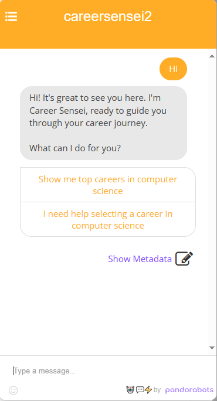

CareerSensei Chatbot
====================

Welcome to CareerSensei, your personal career exploration assistant! This chatbot is designed to help you discover exciting career opportunities in the field of computer science.

Features
--------

*   Interactive conversational interface
    
*   Tailored career recommendations based on user preferences
    
*   Easy-to-use buttons for seamless navigation
    
*   Integration with Pandorabot platform for efficient deployment

    

    

    

Getting Started
---------------

1.  Visit the [Pandorabot](https://www.pandorabots.com/) platform.
    
2.  Deploy the provided AIML files on the platform.
    
3.  Customize the chatbot responses and questions to suit your needs.
    
4.  Share the chatbot link with users to start exploring career options!
    

Usage
-----

*   Greet the chatbot with common salutations like "Hi" or "Hello".
    
*   Select options presented by the chatbot to navigate through the career exploration process.
    
*   Engage in meaningful conversations to receive personalized career recommendations.
    

Feedback
--------

Your feedback is valuable! If you encounter any issues or have suggestions for improvement, feel free to [open an issue](https://github.com/yourusername/CareerSensei/issues).

Contributors
------------

*   [Your Name](https://github.com/maaxxxx22))
    

    

License
-------

This project is licensed under the MIT License.
