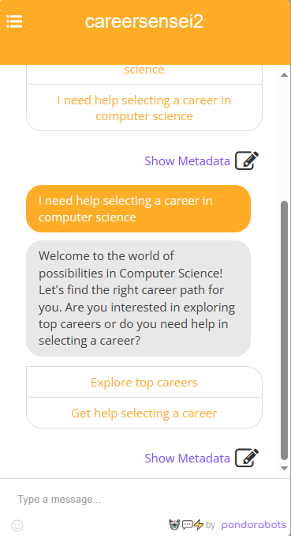
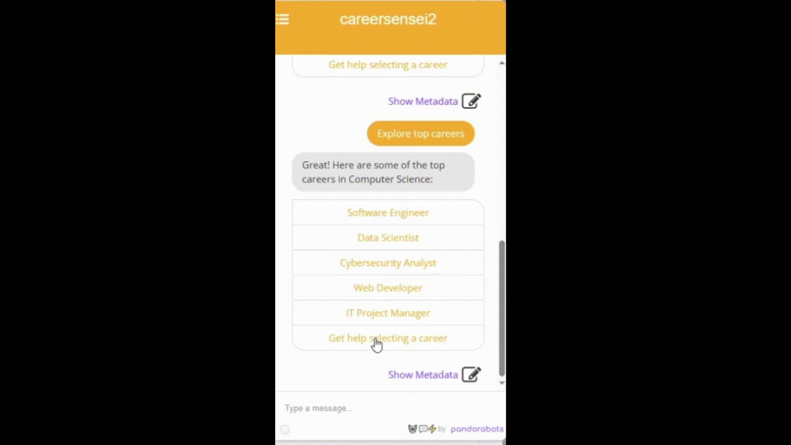

CareerSensei Chatbot
====================

The creation of this chatbot was part of a project for the C951 Introduction to Artificial Intelligence course at WGU. This chatbot project specifically aimed to showcase the application of natural language processing and machine learning techniques to assist users in exploring career options in computer science. 
CareerSensei is a personal career exploration assistant. This chatbot is designed to help students discover exciting career opportunities in the field of computer science.

Features
--------

*   Interactive conversational interface
    
*   Tailored career recommendations based on user preferences
    
*   Easy-to-use buttons for seamless navigation
    
*   Integration with Pandorabot platform for efficient deployment

    
    
    

    
  

Getting Started
---------------

1.  Visit the [Pandorabot](https://www.pandorabots.com/) platform.
    
2.  Deploy the provided AIML files on the platform.
    
3.  Customize the chatbot responses and questions to suit your needs.
    
4.  Share the chatbot link with users to start exploring career options!

   &nbsp;&nbsp;&nbsp;&nbsp;**To run the chatbot locally, follow these steps:**

1. Clone this repository to your local machine.

2. Open the project folder in your preferred code editor.

3. Run the chatbot application using the provided scripts.
    

Usage
-----

*   Greet the chatbot with common salutations like "Hi" or "Hello".
    
*   Select options presented by the chatbot to navigate through the career exploration process.
    
*   Engage in meaningful conversations to receive personalized career recommendations.
    

Feedback
--------

Your feedback is valuable! If you encounter any issues or have suggestions for improvement, feel free to [open an issue](https://github.com/yourusername/CareerSensei/issues).

Contributors
------------

*   [Okunta Braide](https://github.com/maaxxxx22)
    

    

License
-------

This project is licensed under the MIT License.
